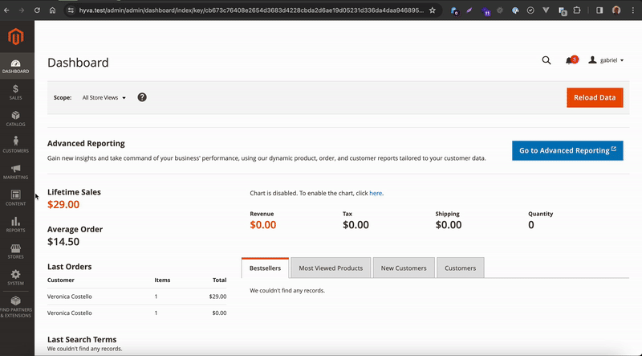

# Gtstudio Hyva Theme Variables

![Supported Magento Versions][ico-compatibility]

## Description

This module allows you to control Hyvä variables by the admin 



## Installation

### Composer

- Install the module composer by running `composer require gtstudio/module-theme-variables`
- enable the module by running `php bin/magento module:enable Gtstudio_HyvaThemeVariables`
- apply database updates by running `php bin/magento setup:upgrade`\*

- For information about a module installation in Magento 2, see [Enable or disable modules](https://devdocs.magento.com/guides/v2.4/install-gde/install/cli/install-cli-subcommands-enable.html).

## Usage

Insert your variables into your theme child in `web/tailwind/tailwind.config.js` 

Below is a sample of configurations of this file:

```
...
module.exports = hyvaModules.mergeTailwindConfig({
  theme: {
    extend: {
        screens: {
            'sm': "var(--variables_media_queries_sm)",
            'md': "var(--variables_media_queries_md)",
            'lg': "var(--variables_media_queries_lg)",
            'xl': "var(--variables_media_queries_xl)",
            '2xl': "var(--variables_media_queries_2xl)",
        },
      fontFamily: {
        sans: ["var(--variables_font_family)", "Segoe UI", "Helvetica Neue", "Arial", "sans-serif"]
      },
      ...
});
```

```
--variables_media_queries_sm
--variables_media_queries_md
--variables_media_queries_lg
--variables_media_queries_xl
--variables_media_queries_2xl
--variables_font_family
--variables_colors_primary_lighter
--variables_colors_primary_default
--variables_colors_primary_darker
--variables_colors_secondary_lighter
--variables_colors_secondary_default
--variables_colors_secondary_darker
--variables_text_colors_primary_lighter
--variables_text_colors_primary_default
--variables_text_colors_primary_darker
--variables_text_colors_secondary_lighter
--variables_text_colors_secondary_default
--variables_text_colors_secondary_darker
--variables_background_colors_primary_lighter
--variables_background_colors_primary_default
--variables_background_colors_primary_darker
--variables_background_colors_secondary_lighter
--variables_background_colors_secondary_default
--variables_background_colors_secondary_darker
--variables_background_colors_container_lighter
--variables_background_colors_container_default
--variables_background_colors_container_darker
--variables_border_colors_primary_lighter
--variables_border_colors_primary_default
--variables_border_colors_primary_darker
--variables_border_colors_secondary_lighter
--variables_border_colors_secondary_default
--variables_border_colors_secondary_darker
--variables_border_colors_container_lighter
--variables_border_colors_container_default
--variables_border_colors_container_darker
--variables_heights_14
--variables_heights_a11y
--variables_heights_screen_25
--variables_heights_screen_50
--variables_heights_screen_75
--variables_widths_8
--variables_widths_20
--variables_widths_40
--variables_widths_48
--variables_container_padding
--var // variable generated dinamically in Aditional variables section
```

### Adding new variables

You can add your variables in Content > Design > Configuration then select your theme and add the variables in "Variables" Section.

After this step you need to clear magento cache.

In your less files you can use escape for css3 variables support.

Eg : `color: ~"var(--color-primary)"`

## Extensibility

Extension developers can interact with this module. For more information about the Magento extension mechanism, see [Magento plug-ins](https://devdocs.magento.com/guides/v2.4/extension-dev-guide/plugins.html).

[The Magento dependency injection mechanism](https://devdocs.magento.com/guides/v2.4/extension-dev-guide/depend-inj.html) enables you to override the functionality of the module.

### UI components

You can extend product and category updates using the UI components located in the `view/adminhtml/ui_component` directory.

For information about a UI component in Magento 2, see [Overview of UI components](https://devdocs.magento.com/guides/v2.4/ui_comp_guide/bk-ui_comps.html).

## Compatibility

This module requires PHP 8 or higher.

## Additional information

For information about significant changes in patch releases, see [Release information](https://devdocs.magento.com/guides/v2.4/release-notes/bk-release-notes.html).

[ico-compatibility]: https://img.shields.io/badge/magento-%202.4-brightgreen.svg?logo=magento&longCache=true&style=flat-square